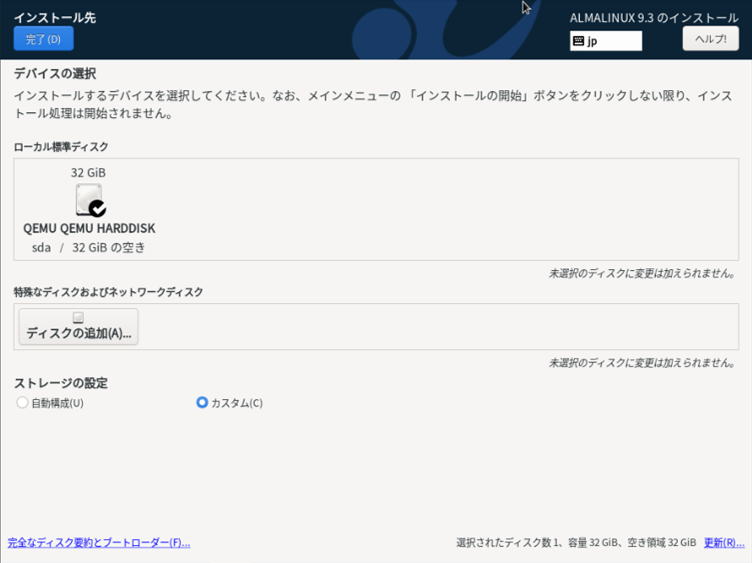
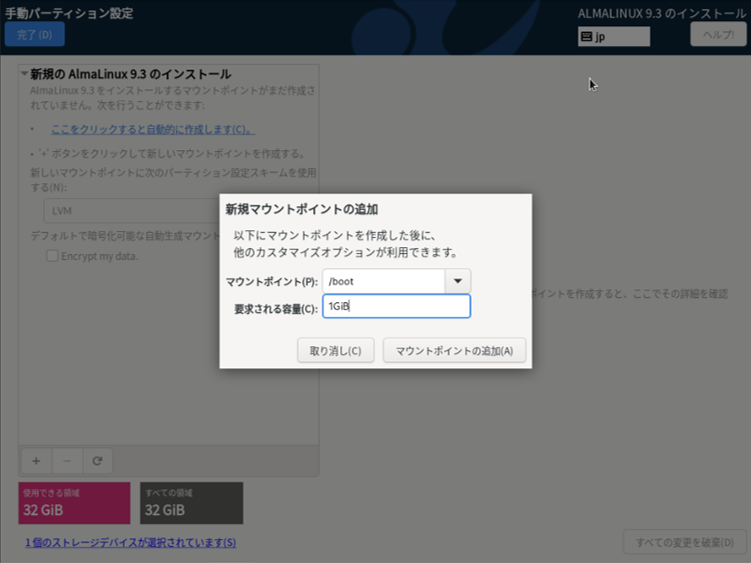
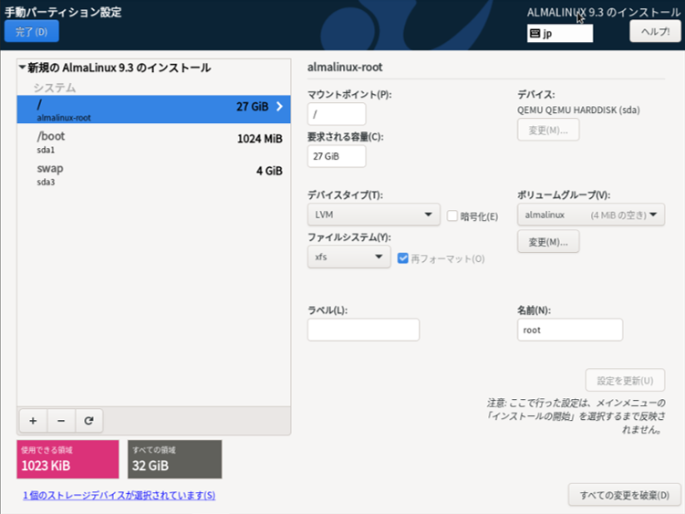

## RHEL9

- Alma Linux 9
    - https://repo.almalinux.org/almalinux/9.5/isos/x86_64/AlmaLinux-9.5-x86_64-minimal.iso

## VirtualBoxの準備

Machine -> Newで仮想マシンの作成を開始し、以下を設定してCreateをクリック。

| 項目名 | 設定例 |
| ------ | ------ |
| Type | Linux |
| Version | RHEL系の64bitの場合はRed Hat (64-bit)を選択 |
| Memory | 2GB以上 |
| Hard disk | Create a virtual hard disk nowを選択 |

仮想ディスクの作成ダイアログが出てくるので以下の設定でCreateをクリック。

| 項目名 | 設定例 |
| ------ | ------ |
| 保存先 | ゲストマシンの容量を確認して適切なディスク上に指定する。 |
| File size | 20GB以上 |
| Hard disk | VDI |
| Memory | 1GB以上 |
| Storage on physical hard disk|どちらでも良い。<br>Fixed sizeのほうがパフォーマンスはいいらしい。 |

出来上がった仮想マシンを右クリックして「Settings」を開き、OKをクリック。

| 項目名 | 設定例 |
| ------ | ------ |
| Storage | Controller: IDE<br>Emptyをクリックし、右のAttributesのOptical DriveのCDマークをクリックし、Choose Virtual Oprical Disk Fileを選択し、ダウンロードしたISOファイルを選択する。 |
| Network | Adapter 1<br>Attached to: Bridged Adapterを選択する。<br>Host-only adapterでもよい。その場合は192.168のIPになる。 |

仮想マシンをダブルクリックして起動。

※Proxmoxを使っている場合はCPU TypeをHostにする必要があります。kernel panicとなり起動できません。( https://forums.almalinux.org/t/alma-linux-9-kernel-panic-on-install/1201 )

## Alma Linuxのインストール

Install Alma Linux 9を選択してインストーラーを起動。
インストールディスクのチェックはSKIPする。
インストラーの手順にしたがってインストール（最小限のインストール）し、再起動する。

| 項目名 | 設定例 |
| ------ | ------ |
| ソフトウェア | 最小限のインストール |
| ネットワークとホスト名 | 「オン」にして、ホスト名に任意の名称を入力。 |
| インストール先 | 内容を確認して「完了」をクリック。 |

### ディスクパーティション

EL9系から`/`（root）パーティションと`/home`パーティションが絶妙な割合で自動的に作られる。  
100GBのディスクを設定しても30GB/60GBといった形で、十分な容量を確保できないことがあるので、パーティションを独自で設定する。  
マウントポイントと最低限の際は以下の通り。  

| マウントポイント | デバイスタイプ | サイズ | 説明 |
|:---|:---|:---|:---|
| `/boot` | 標準パーティション | 1GiB | ブートパーティション |
| `/boot/efi` | 標準パーティション | 1GiB | UEFIのためのシステムパーティション、必要であれば |
| `swap` | 標準パーティション | RAMの2倍のサイズ | スワップ領域 |
| `/` | LVM | 残りのサイズ | ルートパーティション |
| `/home` | KVM | 特に必要なければ設定は不要 |  |

参考：[B.4. 推奨されるパーティション設定スキーム | 標準的な RHEL 9 インストールの実行 | Red Hat Enterprise Linux | 9 | Red Hat Documentation](https://docs.redhat.com/ja/documentation/red_hat_enterprise_linux/9/html/performing_a_standard_rhel_9_installation/recommended-partitioning-scheme_partitioning-reference)

  
  
  

### インストール開始

以上が終わると、「インストール開始」ボタンが有効になる。
インストール実行中にrootユーザーのパスワードを設定する。「完了」ボタンは2回クリックしないと行けないので注意。
最小構成のインストールの場合は数分で終わる。

以降、特に指定のない限りはrootユーザーで行うこと。

## 初期設定

### ネットワークの設定

ネットワークはインストール時に有効になっているので、特に設定することはない。
ipコマンドでIPアドレスを確認しておく。

```bash
[root@alma9 ~]# ip addr
```

### ログイン用ユーザーを作成

```bash
[root@alma9 ~]# useradd webmaster
[root@alma9 ~]# passwd webmaster
```

SSHはデフォルトで設定されているので、移行はSSHクライアントで接続して作業したほうが良いです。

- SSHクライアント
  - PuTTY
  - Tera Term

macOSはターミナル、Windows 10/11でもコマンドプロンプトでSSHコマンドが使えます。

### 最低限必要なパッケージのインストールと設定

EL9はNTPではなくChronyを使用します。またパッケージインストールコマンドが`yum`から`dnf`に変更されています。一応`yum`は`dnf`のエイリアスとして使用できるみたいです。
たまにOpenSSHのバージョンが、sshdと異なっている場合があるので、最新にしておきます。

```bash
[root@alma9 ~]# dnf install chrony vim wget zip unzip openssh subscription-manager
```

```bash
[root@alma9 ~]# vi /etc/bashrc
以下を最後の行の1つ前に追加
alias ll='ls -la'
alias la='ls -A'
export LANG=C
export EDITOR=vim
export LS_COLORS=$LS_COLORS':di=33'
alias vi='vim'
----------
[root@alma9 ~]# vi /etc/vimrc

以下を最後の行に追加
" ORIGINAL SETTINGS
set nowrap nu ic noswapfile nobackup
hi Comment ctermfg=2

" Indents
function SetIndentWeb()
    set tabstop=2 softtabstop=2 shiftwidth=2
endfunction

set tabstop=4 softtabstop=4 shiftwidth=4
autocmd BufNewFile,BufRead *.html,*.css,*.js :call SetIndentWeb()

set autoindent smartindent
set expandtab
"set noexpandtab

set iminsert=0 imsearch=0

" for Japanese
set encoding=utf-8
set fileencodings=iso-2022-jp,euc-jp,sjis,utf-8
set fileformats=unix,dos,mac
----------
[root@alma9 ~]# source /etc/bashrc
```

### リポジトリの追加

以下のリポジトリはよく使うのでインストールしておきます。

- EPEL (https://fedoraproject.org/wiki/EPEL)
  - インストール方法：https://docs.fedoraproject.org/en-US/epel/getting-started/#_other_rhel_9_compatible_distributions
  - Alma Linux 9の場合、Other RHEL 9 compatible distributionsの手順に従う。
  - Fedoraプロジェクトのリポジトリ。
- remi repo（http://rpms.famillecollet.com/）
  - インストール方法：http://blog.remirepo.net/pages/Config-en
  - Alma Linux 9の場合、Enterprise Linux 9の手順に従う。
  - PHPの更新が頻繁に行われているリポジトリ。
- MySQL Yum Repository (http://dev.mysql.com/downloads/repo/yum/)
  - インストール方法：http://dev.mysql.com/doc/mysql-yum-repo-quick-guide/en/
  - MySQLのオフィシャルリポジトリ。
  - EL9はデフォルトでMySQL 8.0がインストール可能。MySQLも現時点ではリポジトリを用意していないみたい。

remi repoはデフォルトでは無効なので、有効なリポジトリにしておきます。

```bash
[root@alma9 ~]# vi /etc/yum.repos.d/remi.repo
  5 [remi]
 10 enabled=1
```

またAlma Linuxの場合はExtra Repositoriesの案内があるので、このあたりも入れておくと良いと思います。

- Alma Linux Extra Repositories
  - インストール方法：https://wiki.almalinux.org/repos/Extras.html

まずは基本システムのアップグレード

```bash
[root@alma9 ~]# dnf update
```

#### Remi RepoのPHPのインストール設定ウィザード

https://rpms.remirepo.net/wizard/

PHPのバージョンを固定してインストールするモードと、複数のバージョンをインストールするバージョンのインストール方法が異なります。
上記リンクから条件を設定してインストールに必要にコマンドを取得します。
詳細はPHPのインストールセクションで記します。
